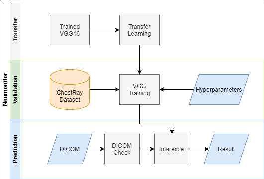
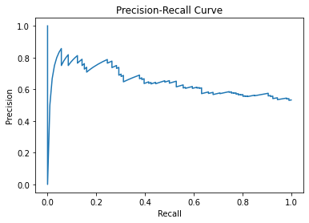
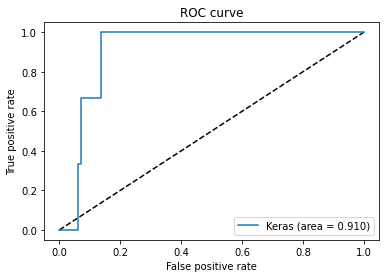

# FDA  Submission

**Your Name:** Irving Vasquez

**Name of your Device:** Neumonitor

## Algorithm Description 

### 1. General Information

**Intended Use Statement:** This algorithm is intended for assisting a radiologist in pneumonia identification from chest x-rays.

**Indications for Use:**  It is indicated for use in male and female patients within the age range from 10-89 years with chest x-rays taken in the AP and PA view positions on a ER setting. 

**Device Limitations:** Ages below 10 and above 89 are no recommended given the not enough examples where used. The presence of infiltration and consolidation in the image may lead to improved accuracy of the algorithm.

**Clinical Impact of Performance:** Algorithm performance shows that it will be useful for screening chest x-rays for pneumonia and may also be used for workflow prioritization.

### 2. Algorithm Design and Function

<< Insert Algorithm Flowchart >>

**DICOM Checking Steps:**

Open DICOM file to verify the body part examined was chest
Check DICOM file to verify the imaging modality was DX
Check the DICOM file to verify the view positions were AP and PA

**Preprocessing Steps:**

Image normalization
Image resizing

**CNN Architecture:**

### 3. Algorithm Training

**Parameters:**
* Types of augmentation used during training: horizontal_flip, height_shift_range= 0.1, width_shift_range=0.1, rotaion_range=20, shear_range = 0.1, zoom_range=0.1
* Batch size: 200
* Optimizer learning rate: 1e-4
* Layers of pre-existing architecture that were frozen: 13 convolutionals
* Layers of pre-existing architecture that were fine-tuned: 0
* Layers added to pre-existing architecture: 4 fully connected

<< Insert algorithm training performance visualization >> 

I did not storage this values since it was not indicated in the training template, after training I can't recover it.

<< Insert P-R curve >>

Precision-Recall Curve

ROC Curve

**Final Threshold and Explanation:**
I am selecting sensibility as the target metric since I want to reduce false negatives; however I do not want to a system that labels all images as 'positive'. Therefore, I selected threshold equal to 0.045, because it shows an acceptable trade-off between sensibility and specificity

### 4. Databases
 (For the below, include visualizations as they are useful and relevant)

**Description of Training Dataset:** 
The training dataset was configured using a stratification strategy for the Pneumonia class. It contains the 80% percent of examples. A unique label for each disease was added to each example.

**Description of Validation Dataset:** 
Validation dataset was also configured using a stratification strategy. It contains the 80% of the original dataset. A unique label for each disease was added to each example.

### 5. Ground Truth

The labels were generated by automatic text analysis of radiologists's reports using a Natural Language Processing (NLP) algorithm. The NLP algorithm was reported to reach over 90% accuracy. NLP analysis is fast and cost effective but it has inherent issues which might affect the accuracy of the algorithm and limit its clinical applications under the given accuracy.

### 6. FDA Validation Plan

**Patient Population Description for FDA Validation Dataset:**

The FDA validation dataset was acquired from six patients, all men with ages 58, 71 and each of the remaining four being 81 years old.

**Ground Truth Acquisition Methodology:**

The labels were generated by automatic text analysis of radiologists's reports using a Natural Language Processing (NLP) algorithm. The NLP algorithm was reported to reach over 90% accuracy. NLP analysis is fast and cost effective but it has inherent issues which might affect the accuracy of the algorithm and limit its clinical applications under the given accuracy.

**Algorithm Performance Standard:**

F1 score reached of 0.298 is lower that the state of the art algorithm CheXNet (Rajpurtar, et al., 2017) that reaches 0.435. A deeper study could improve our F1 score.
